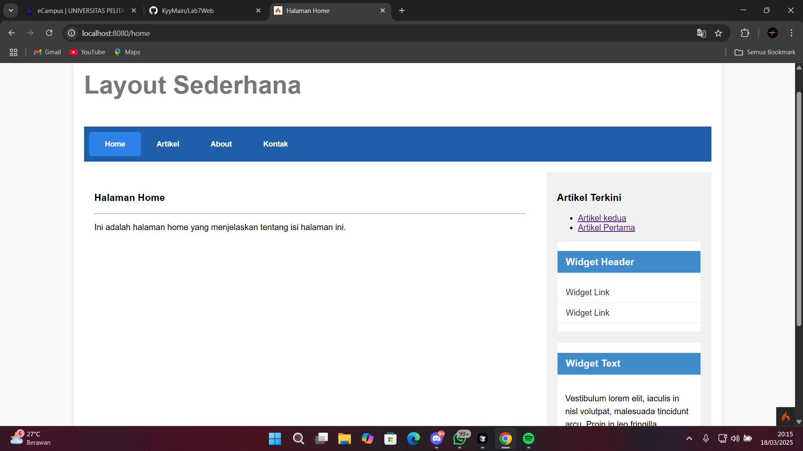
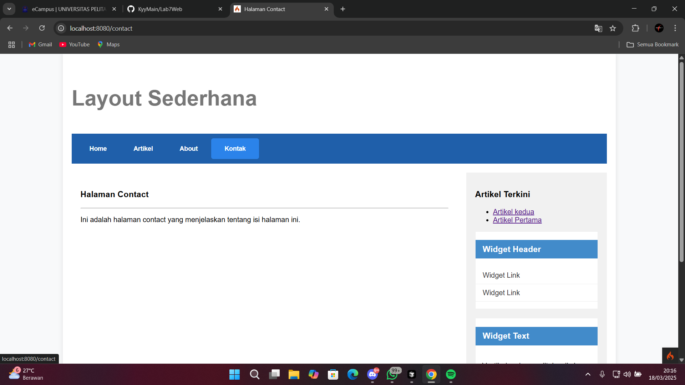
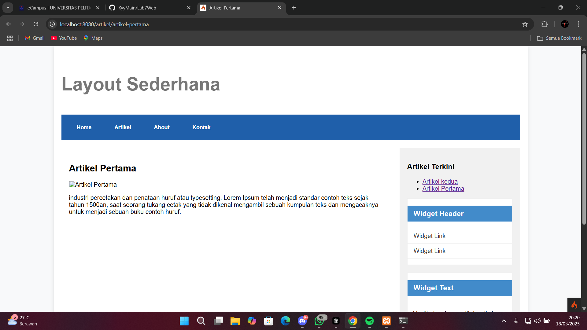
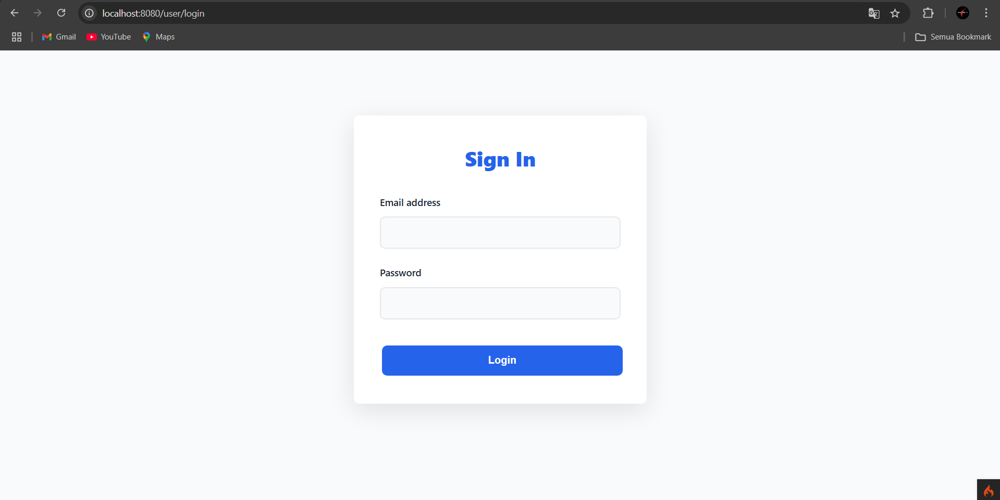
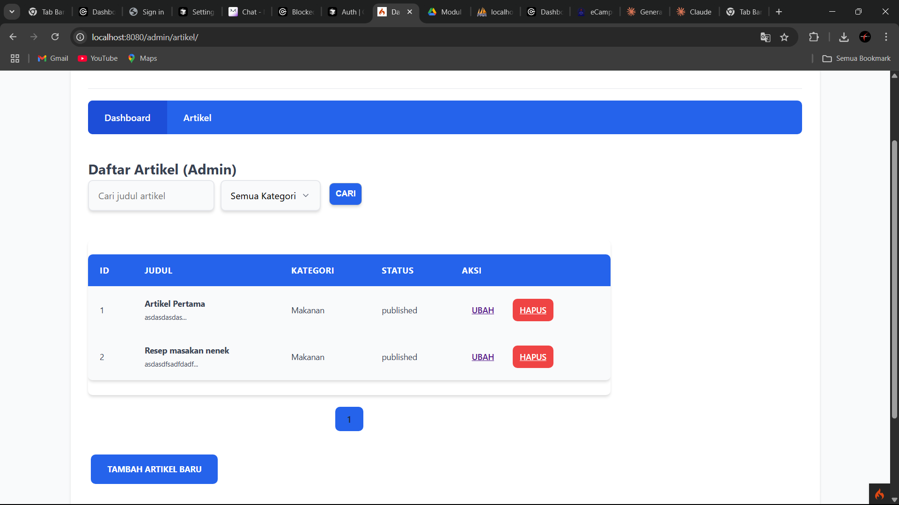
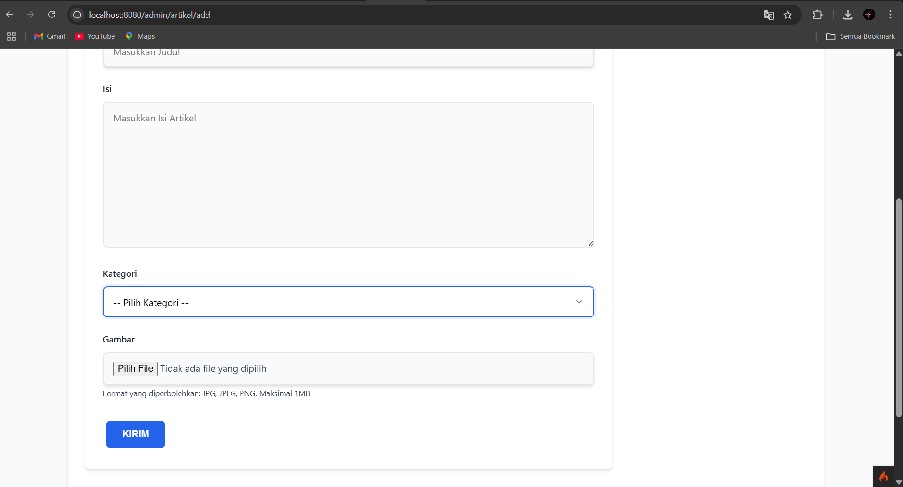
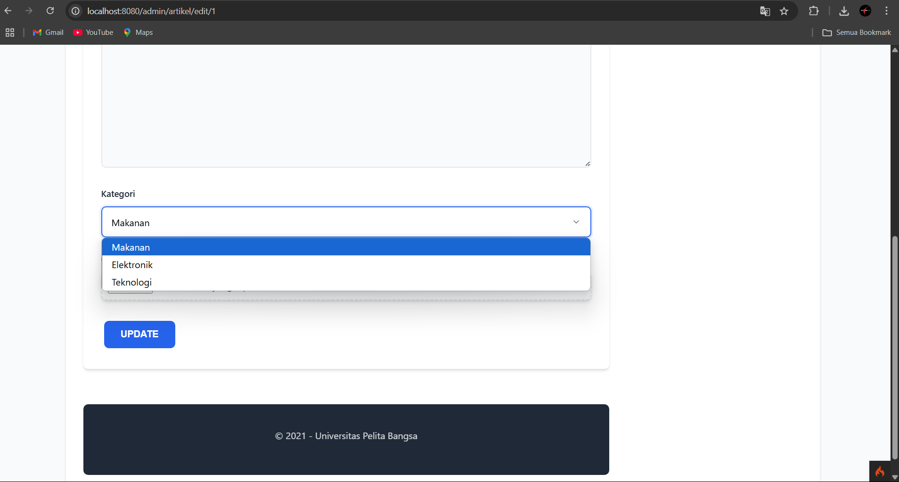

# Lab7Web
| Keterangan | Data Diri                |
| ---------- | ------------------- |
| **Nama**   | Eky Fikri Yamansyah |
| **NIM**    | 312310572           |
| **Kelas**  | TI.23.A6            |

# Daftar Isi :
1. [Praktikum 1](#praktikum-1)
2. [Praktikum 2](#praktikum-2)
3. [Praktikum 3](#praktikum-3)
4. [Praktikum 4](#praktikum-4)
5. [Praktikum 5](#praktikum-5)
6. [Praktikum 6](#praktikum-6)
7. [Praktikum 7](#praktikum-7)
8. [Praktikum 8](#praktikum-8)

## License
This project is licensed under the MIT License - see the [LICENSE](LICENSE) file for details.

## Laporan Project Lab 7 - CodeIgniter 4

## Praktikum 1
### 1. Pendahuluan
Project ini merupakan implementasi web menggunakan framework CodeIgniter 4. CodeIgniter 4 adalah framework PHP modern yang mengikuti pola MVC (Model-View-Controller) dan menyediakan berbagai fitur untuk pengembangan web yang cepat dan efisien.

### 2. Struktur Project
Project ini terdiri dari beberapa komponen utama:
- **Controllers**: Menangani logika aplikasi
  - `Home.php`: Controller untuk halaman utama
  - `Artikel.php`: Controller untuk manajemen artikel
  - `page.php`: Controller untuk halaman statis
- **Views**: Menangani tampilan
  - Halaman utama (`home.php`)
  - Halaman artikel (`artikel/`)
  - Halaman statis (`about.php`, `contact.php`)
  - Komponen template (`components/`, `layout/`, `template/`)
- **Models**: Menangani interaksi dengan database
- **Config**: Konfigurasi aplikasi
- **Database**: Migrasi dan seeder database

### 3. Fitur Aplikasi
1. **Halaman Utama**
   - Tampilan welcome message
   - Navigasi ke berbagai halaman

2. **Manajemen Artikel**
   - Tampilan daftar artikel
   - Detail artikel
   - Fungsi CRUD artikel

3. **Halaman Statis**
   - Halaman About
   - Halaman Contact

4. **Template System**
   - Layout yang konsisten
   - Komponen yang dapat digunakan kembali
   - Sistem navigasi

### 4. Teknologi yang Digunakan
- PHP 7.4 atau lebih tinggi
- CodeIgniter 4 Framework
- MySQL Database
- HTML, CSS, JavaScript
- Bootstrap (untuk tampilan)

### 5. Instalasi dan Penggunaan
1. Clone repository
2. Konfigurasi database di file `.env`
3. Jalankan migrasi database
4. Akses melalui web server (Apache/XAMPP)

### 6. Langkah-langkah Implementasi

#### 6.1 Persiapan Awal
1. Install XAMPP (Apache, MySQL, PHP)
2. Download CodeIgniter 4 dari website resmi
3. Ekstrak file CodeIgniter ke direktori htdocs
4. Rename folder project sesuai kebutuhan

#### 6.2 Konfigurasi Database
1. Buat database baru di phpMyAdmin
2. Konfigurasi koneksi database di file `.env`:
   ```
   database.default.hostname = localhost
   database.default.database = nama_database
   database.default.username = root
   database.default.password = 
   database.default.DBDriver = MySQLi
   ```

#### 6.3 Pembuatan Controller
1. Buat controller baru menggunakan perintah:
   ```
   php spark make:controller Artikel
   ```
2. Implementasi method CRUD di controller:
   - index() - menampilkan daftar artikel
   - create() - form tambah artikel
   - store() - menyimpan artikel baru
   - edit() - form edit artikel
   - update() - update artikel
   - delete() - hapus artikel

#### 6.4 Pembuatan Model
1. Buat model baru menggunakan perintah:
   ```
   php spark make:model ArtikelModel
   ```
2. Definisikan properti dan method yang diperlukan
3. Implementasi relasi dengan tabel lain jika diperlukan

#### 6.5 Pembuatan View
1. Buat struktur folder views:
   - `views/artikel/` - untuk view artikel
   - `views/layout/` - untuk template
   - `views/components/` - untuk komponen yang dapat digunakan kembali

2. Buat file view untuk setiap halaman:
   - `index.php` - daftar artikel
   - `create.php` - form tambah
   - `edit.php` - form edit
   - `show.php` - detail artikel

#### 6.6 Implementasi Template
1. Buat layout utama di `views/layout/main.php`
2. Implementasi header dan footer
3. Buat komponen navigasi
4. Terapkan template ke semua halaman

#### 6.7 Routing
1. Konfigurasi route di `app/Config/Routes.php`
2. Definisikan route untuk setiap endpoint
3. Implementasi middleware jika diperlukan

#### 6.8 Validasi dan Keamanan
1. Implementasi validasi form
2. Tambahkan CSRF protection
3. Implementasi sanitasi input
4. Tambahkan autentikasi jika diperlukan

#### 6.9 Testing
1. Test semua fitur CRUD
2. Validasi tampilan di berbagai browser
3. Test responsivitas
4. Perbaiki bug yang ditemukan

### 7. Kode Program

#### 7.1 Controller (Artikel.php)
```php
<?php

namespace App\Controllers;

use App\Controllers\BaseController;
use App\Models\ArtikelModel;

class Artikel extends BaseController
{
    protected $artikelModel;

    public function __construct()
    {
        $this->artikelModel = new ArtikelModel();
    }

    public function index()
    {
        $data = [
            'title' => 'Daftar Artikel',
            'artikel' => $this->artikelModel->findAll()
        ];
        return view('artikel/index', $data);
    }

    public function create()
    {
        $data = [
            'title' => 'Tambah Artikel',
            'validation' => \Config\Services::validation()
        ];
        return view('artikel/create', $data);
    }

    public function store()
    {
        // Validasi input
        $rules = [
            'judul' => 'required|min_length[3]',
            'isi' => 'required'
        ];

        if (!$this->validate($rules)) {
            return redirect()->to('/artikel/create')->withInput();
        }

        $this->artikelModel->save([
            'judul' => $this->request->getPost('judul'),
            'isi' => $this->request->getPost('isi')
        ]);

        return redirect()->to('/artikel')->with('message', 'Artikel berhasil ditambahkan');
    }

    public function edit($id)
    {
        $data = [
            'title' => 'Edit Artikel',
            'artikel' => $this->artikelModel->find($id),
            'validation' => \Config\Services::validation()
        ];
        return view('artikel/edit', $data);
    }

    public function update($id)
    {
        $rules = [
            'judul' => 'required|min_length[3]',
            'isi' => 'required'
        ];

        if (!$this->validate($rules)) {
            return redirect()->to('/artikel/edit/' . $id)->withInput();
        }

        $this->artikelModel->update($id, [
            'judul' => $this->request->getPost('judul'),
            'isi' => $this->request->getPost('isi')
        ]);

        return redirect()->to('/artikel')->with('message', 'Artikel berhasil diupdate');
    }

    public function delete($id)
    {
        $this->artikelModel->delete($id);
        return redirect()->to('/artikel')->with('message', 'Artikel berhasil dihapus');
    }
}
```

#### 7.2 Model (ArtikelModel.php)
```php
<?php

namespace App\Models;

use CodeIgniter\Model;

class ArtikelModel extends Model
{
    protected $table = 'artikel';
    protected $primaryKey = 'id';
    protected $useAutoIncrement = true;
    protected $returnType = 'array';
    protected $allowedFields = ['judul', 'isi'];
    protected $useTimestamps = true;
    protected $createdField = 'created_at';
    protected $updatedField = 'updated_at';
}
```

#### 7.3 View (artikel/index.php)
```php
<?= $this->extend('layout/main') ?>

<?= $this->section('content') ?>
<div class="container mt-4">
    <h1><?= $title ?></h1>
    
    <?php if (session()->getFlashdata('message')) : ?>
        <div class="alert alert-success">
            <?= session()->getFlashdata('message') ?>
        </div>
    <?php endif; ?>

    <a href="/artikel/create" class="btn btn-primary mb-3">Tambah Artikel</a>

    <div class="table-responsive">
        <table class="table table-bordered">
            <thead>
                <tr>
                    <th>No</th>
                    <th>Judul</th>
                    <th>Aksi</th>
                </tr>
            </thead>
            <tbody>
                <?php foreach ($artikel as $row) : ?>
                    <tr>
                        <td><?= $row['id'] ?></td>
                        <td><?= $row['judul'] ?></td>
                        <td>
                            <a href="/artikel/edit/<?= $row['id'] ?>" class="btn btn-warning btn-sm">Edit</a>
                            <form action="/artikel/delete/<?= $row['id'] ?>" method="post" class="d-inline">
                                <button type="submit" class="btn btn-danger btn-sm" onclick="return confirm('Yakin ingin menghapus?')">Hapus</button>
                            </form>
                        </td>
                    </tr>
                <?php endforeach; ?>
            </tbody>
        </table>
    </div>
</div>
<?= $this->endSection() ?>
```

#### 7.4 View (artikel/create.php)
```php
<?= $this->extend('layout/main') ?>

<?= $this->section('content') ?>
<div class="container mt-4">
    <h1><?= $title ?></h1>

    <form action="/artikel/store" method="post">
        <?= csrf_field() ?>
        
        <div class="mb-3">
            <label for="judul" class="form-label">Judul</label>
            <input type="text" class="form-control <?= validation_show_error('judul') ? 'is-invalid' : '' ?>" 
                   id="judul" name="judul" value="<?= old('judul') ?>">
            <div class="invalid-feedback">
                <?= validation_show_error('judul') ?>
            </div>
        </div>

        <div class="mb-3">
            <label for="isi" class="form-label">Isi Artikel</label>
            <textarea class="form-control <?= validation_show_error('isi') ? 'is-invalid' : '' ?>" 
                      id="isi" name="isi" rows="5"><?= old('isi') ?></textarea>
            <div class="invalid-feedback">
                <?= validation_show_error('isi') ?>
            </div>
        </div>

        <button type="submit" class="btn btn-primary">Simpan</button>
        <a href="/artikel" class="btn btn-secondary">Kembali</a>
    </form>
</div>
<?= $this->endSection() ?>
```

#### 7.5 Layout (layout/main.php)
```php
<!DOCTYPE html>
<html lang="en">
<head>
    <meta charset="UTF-8">
    <meta name="viewport" content="width=device-width, initial-scale=1.0">
    <title><?= $title ?? 'CodeIgniter 4' ?></title>
    <link href="https://cdn.jsdelivr.net/npm/bootstrap@5.3.0/dist/css/bootstrap.min.css" rel="stylesheet">
</head>
<body>
    <nav class="navbar navbar-expand-lg navbar-dark bg-dark">
        <div class="container">
            <a class="navbar-brand" href="/">Lab7Web</a>
            <button class="navbar-toggler" type="button" data-bs-toggle="collapse" data-bs-target="#navbarNav">
                <span class="navbar-toggler-icon"></span>
            </button>
            <div class="collapse navbar-collapse" id="navbarNav">
                <ul class="navbar-nav">
                    <li class="nav-item">
                        <a class="nav-link" href="/">Home</a>
                    </li>
                    <li class="nav-item">
                        <a class="nav-link" href="/artikel">Artikel</a>
                    </li>
                    <li class="nav-item">
                        <a class="nav-link" href="/about">About</a>
                    </li>
                    <li class="nav-item">
                        <a class="nav-link" href="/contact">Contact</a>
                    </li>
                </ul>
            </div>
        </div>
    </nav>

    <?= $this->renderSection('content') ?>

    <footer class="bg-dark text-white text-center py-3 mt-5">
        <p class="mb-0">&copy; <?= date('Y') ?> Lab7Web. All rights reserved.</p>
    </footer>

    <script src="https://cdn.jsdelivr.net/npm/bootstrap@5.3.0/dist/js/bootstrap.bundle.min.js"></script>
</body>
</html>
```

#### 7.6 Routes (Routes.php)
```php
<?php

$routes->get('/', 'Home::index');
$routes->get('/about', 'Page::about');
$routes->get('/contact', 'Page::contact');

// Artikel Routes
$routes->get('/artikel', 'Artikel::index');
$routes->get('/artikel/create', 'Artikel::create');
$routes->post('/artikel/store', 'Artikel::store');
$routes->get('/artikel/edit/(:num)', 'Artikel::edit/$1');
$routes->post('/artikel/update/(:num)', 'Artikel::update/$1');
$routes->post('/artikel/delete/(:num)', 'Artikel::delete/$1');
```
### 8. Tampilan
#### Home Page

#### Artikel Page

#### About Page

#### Kontak Page

#### Isi Artikel

#### Admin Panel

#### Edit Artikel

#### Tambah Artikel


### 9. Kesimpulan
Project ini berhasil mengimplementasikan framework CodeIgniter 4 dengan fitur-fitur dasar seperti manajemen artikel dan halaman statis. Penggunaan pola MVC membuat kode lebih terstruktur dan mudah dimaintain. Framework ini sangat cocok untuk pengembangan web yang cepat dan efisien.

### 10. Referensi
- [CodeIgniter 4 Documentation](https://codeigniter.com/user_guide/index.html)
- [PHP Documentation](https://www.php.net/docs.php)
- [Bootstrap Documentation](https://getbootstrap.com/docs/)

## Praktikum 4
# Implementasi Modul Login CodeIgniter 4

README ini mendokumentasikan implementasi modul login dasar menggunakan CodeIgniter 4 dan database MySQL.

## Ringkasan

Proyek ini menunjukkan cara membuat sistem login fungsional dengan autentikasi pengguna dan rute yang dilindungi menggunakan kerangka kerja CodeIgniter 4.

## Prasyarat

- XAMPP atau yang setara (Apache, MySQL)
- PHP 7.4 atau lebih tinggi
- Kerangka kerja CodeIgniter 4

## Pengaturan Database

Buat tabel berikut di database MySQL Anda:

```sql
CREATE TABLE user (
    id INT(11) AUTO_INCREMENT,
    username VARCHAR(200) NOT NULL,
    useremail VARCHAR(200),
    userpassword VARCHAR(200),
    PRIMARY KEY(id)
);
```

## Langkah-langkah Implementasi

### 1. Buat Model User

Buat `UserModel.php` di direktori `app/Models`:

```php
<?php
namespace App\Models;
use CodeIgniter\Model;

class UserModel extends Model
{
    protected $table = 'user';
    protected $primaryKey = 'id';
    protected $useAutoIncrement = true;
    protected $allowedFields = ['username', 'useremail', 'userpassword'];
}
```

### 2. Buat Controller User

Buat `User.php` di direktori `app/Controllers`:

```php
<?php
namespace App\Controllers;
use App\Models\UserModel;

class User extends BaseController
{
    public function index()
    {
        $title = 'Daftar User';
        $model = new UserModel();
        $users = $model->findAll();
        return view('user/index', compact('users', 'title'));
    }

    public function login()
    {
        helper(['form']);
        $email = $this->request->getPost('email');
        $password = $this->request->getPost('password');

        if (!$email) {
            return view('user/login');
        }

        $session = session();
        $model = new UserModel();
        $login = $model->where('useremail', $email)->first();

        if ($login) {
            $pass = $login['userpassword'];
            if (password_verify($password, $pass)) {
                $login_data = [
                    'user_id' => $login['id'],
                    'user_name' => $login['username'],
                    'user_email' => $login['useremail'],
                    'logged_in' => TRUE,
                ];

                $session->set($login_data);
                return redirect('admin/artikel');
            } else {
                $session->setFlashdata("flash_msg", "Password salah.");
                return redirect()->to('/user/login');
            }
        } else {
            $session->setFlashdata("flash_msg", "Email tidak terdaftar.");
            return redirect()->to('/user/login');
        }
    }
    
    public function logout()
    {
        session()->destroy();
        return redirect()->to('/user/login');
    }
}
```

### 3. Buat View Login

Buat `login.php` di direktori `app/views/user`:

```html
<!DOCTYPE html>
<html lang="en">
<head>
    <meta charset="UTF-8">
    <title>Login</title>
    <link rel="stylesheet" href="<?= base_url('/style.css');?>">
</head>
<body>
    <div id="login-wrapper">
        <h1>Sign In</h1>
        <?php if(session()->getFlashdata('flash_msg')):?>
            <div class="alert alert-danger"><?= session()->getFlashdata('flash_msg') ?></div>
        <?php endif;?>
        <form action="" method="post">
            <div class="mb-3">
                <label for="InputForEmail" class="form-label">Alamat Email</label>
                <input type="email" name="email" class="form-control" id="InputForEmail" value="<?= set_value('email') ?>">
            </div>
            <div class="mb-3">
                <label for="InputForPassword" class="form-label">Password</label>
                <input type="password" name="password" class="form-control" id="InputForPassword">
            </div>
            <button type="submit" class="btn btn-primary">Login</button>
        </form>
    </div>
</body>
</html>
```

### 4. Buat Seeder User

Jalankan perintah ini untuk membuat seeder:

```bash
php spark make:seeder UserSeeder
```

Kemudian modifikasi `app/Database/Seeds/UserSeeder.php`:

```php
<?php
namespace App\Database\Seeds;
use CodeIgniter\Database\Seeder;

class UserSeeder extends Seeder
{
    public function run()
    {
        $model = model('UserModel');
        $model->insert([
            'username' => 'admin',
            'useremail' => 'admin@email.com',
            'userpassword' => password_hash('admin123', PASSWORD_DEFAULT),
        ]);
    }
}
```

Jalankan seeder:

```bash
php spark db:seed UserSeeder
```

### 5. Buat Filter Auth

Buat `Auth.php` di direktori `app/Filters`:

```php
<?php 
namespace App\Filters;
use CodeIgniter\HTTP\RequestInterface;
use CodeIgniter\HTTP\ResponseInterface;
use CodeIgniter\Filters\FilterInterface;

class Auth implements FilterInterface
{
    public function before(RequestInterface $request, $arguments = null)
    {
        // jika user belum login
        if (!session()->get('logged_in')) {
            // maka redirect ke halaman login
            return redirect()->to('/user/login');
        }
    }

    public function after(RequestInterface $request, ResponseInterface $response, $arguments = null)
    {
        // Lakukan sesuatu di sini
    }
}
```

Daftarkan filter di `app/Config/Filters.php`:

```php
'auth' => App\Filters\Auth::class
```

## Hasil


## Penggunaan

1. Kunjungi `http://localhost:8080/user/login` untuk mengakses halaman login
2. Gunakan kredensial berikut:
   - **Email:** admin@email.com
   - **Password:** admin123
3. Setelah login berhasil, Anda akan diarahkan ke halaman artikel admin
4. Rute yang dilindungi akan secara otomatis mengarahkan ke halaman login jika tidak terauntentikasi

## Menguji Perlindungan Rute

Coba akses halaman admin seperti `http://localhost:8080/admin/artikel`. Jika Anda belum login, Anda akan diarahkan ke halaman login.

---

*Dokumentasi ini menjelaskan implementasi dasar sistem login menggunakan CodeIgniter 4 dengan fitur autentikasi dan perlindungan rute.*

## Praktikum 5
## Pendahuluan

Praktikum ini membahas implementasi fitur pagination dan pencarian pada aplikasi web menggunakan framework CodeIgniter 4. Kedua fitur ini sangat penting untuk mengelola tampilan data yang banyak dengan cara yang efektif dan user-friendly.

## Tujuan Praktikum

1. Memahami konsep pagination dalam menampilkan data
2. Mengimplementasikan pagination menggunakan library bawaan CodeIgniter 4
3. Membuat fitur pencarian data
4. Mengintegrasikan pagination dengan pencarian

## Langkah-langkah Praktikum

### 1. Membuat Pagination

Pagination merupakan proses yang digunakan untuk membatasi tampilan yang panjang dari data yang banyak pada sebuah website. Fungsi pagination adalah memecah tampilan menjadi beberapa halaman tergantung banyaknya data yang akan ditampilkan pada setiap halaman.

Pada CodeIgniter 4, fungsi pagination sudah tersedia pada library sehingga cukup mudah menggunakannya.

#### 1.1 Modifikasi Controller Artikel

Untuk membuat pagination, buka kembali Controller Artikel, kemudian modifikasi kode pada method `admin_index` seperti berikut:

```php
public function admin_index()
{
    $title = 'Daftar Artikel';
    $model = new ArtikelModel();
    $data = [
        'title' => $title,
        'artikel' => $model->paginate(10), #data dibatasi 10 record per halaman
        'pager' => $model->pager,
    ];
    return view('artikel/admin_index', $data);
}
```

#### 1.2 Menambahkan Link Pagination pada View

Kemudian buka file `views/artikel/admin_index.php` dan tambahkan kode berikut dibawah deklarasi tabel data:

```php
<?= $pager->links(); ?>
```

Selanjutnya buka kembali menu daftar artikel, tambahkan data lagi untuk melihat hasilnya.

### 2. Membuat Pencarian

Pencarian data digunakan untuk memfilter data berdasarkan kriteria tertentu yang diinputkan oleh pengguna.

#### 2.1 Modifikasi Controller untuk Pencarian

Untuk membuat pencarian data, buka kembali Controller Artikel, pada method `admin_index` ubah kodenya seperti berikut:

```php
public function admin_index()
{
    $title = 'Daftar Artikel';
    $q = $this->request->getVar('q') ?? '';
    $model = new ArtikelModel();
    $data = [
        'title' => $title,
        'q' => $q,
        'artikel' => $model->like('judul', $q)->paginate(10), # data dibatasi 10 record per halaman
        'pager' => $model->pager,
    ];
    return view('artikel/admin_index', $data);
}
```

#### 2.2 Menambahkan Form Pencarian pada View

Kemudian buka kembali file `views/artikel/admin_index.php` dan tambahkan form pencarian sebelum deklarasi tabel seperti berikut:

```php
<form method="get" class="form-search">
    <input type="text" name="q" value="<?= $q; ?>" placeholder="Cari data">
    <input type="submit" value="Cari" class="btn btn-primary">
</form>
```

#### 2.3 Modifikasi Link Pager

Dan pada link pager ubah seperti berikut:

```php
<?= $pager->only(['q'])->links(); ?>
```

### 3. Pengujian

Selanjutnya ujicoba dengan membuka kembali halaman admin artikel, masukkan kata kunci tertentu pada form pencarian untuk memastikan fitur berfungsi dengan baik.

## Hasil Praktikum

Setelah mengikuti langkah-langkah di atas, Anda akan memiliki:

1. **Fitur Pagination** yang membatasi tampilan data menjadi 10 record per halaman
2. **Fitur Pencarian** yang dapat memfilter data berdasarkan judul artikel
3. **Integrasi** antara pagination dan pencarian yang berfungsi dengan baik

## Penjelasan Kode

### Penggunaan Method `paginate()`

```php
$model->paginate(10)
```

Method ini secara otomatis membagi data menjadi halaman dengan 10 record per halaman. CodeIgniter 4 secara otomatis menangani parameter halaman dari URL.

### Penggunaan Method `like()`

```php
$model->like('judul', $q)
```

Method ini digunakan untuk melakukan pencarian dengan pattern matching pada kolom 'judul'. Jika `$q` kosong, semua data akan ditampilkan.

### Parameter `only()` pada Pager

```php
$pager->only(['q'])->links()
```

Parameter ini memastikan bahwa query parameter pencarian ('q') tetap dipertahankan saat navigasi antar halaman pagination.

## Kesimpulan

Praktikum ini berhasil mengimplementasikan fitur pagination dan pencarian pada aplikasi CodeIgniter 4. Kedua fitur ini sangat berguna untuk:

1. Meningkatkan performa aplikasi dengan membatasi data yang ditampilkan
2. Memberikan kemudahan bagi pengguna untuk mencari data spesifik
3. Menciptakan user experience yang lebih baik dalam mengelola data yang banyak

Implementasi yang telah dilakukan menunjukkan fleksibilitas dan kemudahan penggunaan library bawaan CodeIgniter 4 dalam menangani operasi pagination dan pencarian data.

## Praktikum 6

## Tujuan

1. Mahasiswa mampu memahami konsep dasar File Upload
2. Mahasiswa mampu membuat File Upload menggunakan Framework CodeIgniter 4

## Instruksi Praktikum

1. Persiapkan text editor misalnya VSCode
2. Buka kembali folder dengan nama lab7_php_ci pada docroot webserver (htdocs)
3. Ikuti langkah-langkah praktikum yang akan dijelaskan berikutnya

## Langkah-langkah Praktikum

### Upload Gambar pada Artikel

Pada praktikum ini, kita akan menambahkan fungsi unggah gambar pada fitur tambah artikel yang telah dibuat sebelumnya.

#### 1. Modifikasi Controller Artikel

Buka kembali Controller Artikel pada project sebelumnya, sesuaikan kode pada method `add` seperti berikut:

```php
public function add()
{
    // validasi data.
    $validation = \Config\Services::validation();
    $validation->setRules(['judul' => 'required']);
    $isDataValid = $validation->withRequest($this->request)->run();
    
    if ($isDataValid)
    {
        $file = $this->request->getFile('gambar');
        $file->move(ROOTPATH . 'public/gambar');
        
        $artikel = new ArtikelModel();
        $artikel->insert([
            'judul' => $this->request->getPost('judul'),
            'isi' => $this->request->getPost('isi'),
            'slug' => url_title($this->request->getPost('judul')),
            'gambar' => $file->getName(),
        ]);
        return redirect('admin/artikel');
    }
    
    $title = "Tambah Artikel";
    return view('artikel/form_add', compact('title'));
}
```

#### 2. Modifikasi Form Tambah Artikel

Kemudian pada file `views/artikel/form_add.php` tambahkan field input file seperti berikut:

```html
<p>
    <input type="file" name="gambar">
</p>
```

#### 3. Menambahkan Encrypt Type pada Form

Dan sesuaikan tag form dengan menambahkan `enctype` type seperti berikut:

```html
<form action="" method="post" enctype="multipart/form-data">
```

#### 4. Membuat Direktori Upload

Pastikan direktori `public/gambar` sudah tersedia. Jika belum, buat direktori tersebut di dalam folder `public` project CodeIgniter.

### Pengujian Upload File

Ujicoba file upload dengan mengakses menu tambah artikel dan pilih file gambar untuk diupload.

## Penjelasan Kode

### 1. Mengambil File dari Request

```php
$file = $this->request->getFile('gambar');
```

Method `getFile()` digunakan untuk mengambil file yang diupload melalui form dengan name "gambar".

### 2. Memindahkan File

```php
$file->move(ROOTPATH . 'public/gambar');
```

Method `move()` digunakan untuk memindahkan file sementara ke direktori tujuan. `ROOTPATH` adalah konstanta yang merujuk ke root directory project.

### 3. Menyimpan Nama File

```php
'gambar' => $file->getName(),
```

Method `getName()` digunakan untuk mendapatkan nama file yang diupload, kemudian disimpan ke database.

### 4. Enkripsi Form

```html
enctype="multipart/form-data"
```

Atribut `enctype` dengan nilai `multipart/form-data` diperlukan pada form yang akan mengupload file.

## Validasi File Upload (Opsional)

Untuk keamanan yang lebih baik, Anda dapat menambahkan validasi file upload:

```php
public function add()
{
    // validasi data dan file
    $validation = \Config\Services::validation();
    $validation->setRules([
        'judul' => 'required',
        'gambar' => [
            'label' => 'Image File',
            'rules' => 'uploaded[gambar]'
                . '|is_image[gambar]'
                . '|mime_in[gambar,image/jpg,image/jpeg,image/gif,image/png,image/webp]'
                . '|max_size[gambar,100]'
                . '|max_dims[gambar,1024,768]',
        ],
    ]);
    
    $isDataValid = $validation->withRequest($this->request)->run();
    
    if ($isDataValid)
    {
        $file = $this->request->getFile('gambar');
        
        // Generate random name for security
        $newName = $file->getRandomName();
        
        $file->move(ROOTPATH . 'public/gambar', $newName);
        
        $artikel = new ArtikelModel();
        $artikel->insert([
            'judul' => $this->request->getPost('judul'),
            'isi' => $this->request->getPost('isi'),
            'slug' => url_title($this->request->getPost('judul')),
            'gambar' => $newName,
        ]);
        return redirect('admin/artikel');
    }
    
    $title = "Tambah Artikel";
    return view('artikel/form_add', compact('title'));
}
```

## Hasil

### Tampilan Artikel

## Menampilkan Gambar

Untuk menampilkan gambar yang telah diupload pada halaman artikel, tambahkan kode berikut pada view:

```html
<?php if ($artikel['gambar']) : ?>
    <div class="entry-image">
        " alt="<?= $artikel['judul'] ?>">
    </div>
<?php endif; ?>
```

## Hasil Praktikum

Setelah mengikuti langkah-langkah di atas, Anda akan memiliki:

1. **Form upload file** yang dapat menerima file gambar
2. **Fungsi upload** yang menyimpan file ke direktori `public/gambar`
3. **Penyimpanan nama file** ke database untuk referensi
4. **Sistem yang dapat menampilkan gambar** pada halaman artikel

## Kesimpulan

Praktikum ini berhasil mengimplementasikan fitur upload file gambar pada aplikasi CodeIgniter 4. Fitur ini memungkinkan pengguna untuk:

1. Mengunggah gambar sebagai bagian dari artikel
2. Menyimpan file gambar dengan aman di server
3. Menampilkan gambar yang telah diupload

Implementasi upload file ini menggunakan fitur bawaan CodeIgniter 4 yang mudah dan aman digunakan, dengan tambahan validasi untuk memastikan keamanan aplikasi.

# Praktikum 7
## Relasi Tabel dan Query Builder
## Tujuan Praktikum
1. Memahami konsep relasi antar tabel dalam database
2. Mengimplementasikan relasi One-to-Many
3. Melakukan query dengan join tabel menggunakan Query Builder
4. Menampilkan data dari tabel yang berelasi

## Langkah-langkah Praktikum

### 1. Persiapan
- Membuka text editor (VSCode)
- Membuka folder proyek `lab7_php_ci`
- Memastikan MySQL Server sudah berjalan dan database `lab_ci4` siap digunakan

### 2. Membuat Tabel Kategori
Membuat tabel baru bernama `kategori` dengan struktur:

| Field | Tipe Data | Ukuran | Keterangan |
|-------|-----------|--------|------------|
| id_kategori | INT | 11 | PRIMARY KEY, auto_increment |
| nama_kategori | VARCHAR | 100 | |
| slug_kategori | VARCHAR | 100 | |

Query SQL yang dijalankan:
```sql
CREATE TABLE kategori (
    id_kategori INT(11) AUTO_INCREMENT,
    nama_kategori VARCHAR(100) NOT NULL,
    slug_kategori VARCHAR(100),
    PRIMARY KEY (id_kategori)
);
```

### 3. Mengubah Tabel Artikel
Menambahkan foreign key `id_kategori` pada tabel `artikel` untuk membuat relasi dengan tabel `kategori`:

```sql
ALTER TABLE artikel
ADD COLUMN id_kategori INT(11),
ADD CONSTRAINT fk_kategori_artikel
FOREIGN KEY (id_kategori) REFERENCES kategori(id_kategori);
```

### 4. Membuat Model Kategori
Membuat file model baru di `app/Models` dengan nama `KategoriModel.php`:

```php
<?php
namespace App\Models;
use CodeIgniter\Model;

class KategoriModel extends Model
{
    protected $table = 'kategori';
    protected $primaryKey = 'id_kategori';
    protected $useAutoIncrement = true;
    protected $allowedFields = ['nama_kategori', 'slug_kategori'];
}
```

### 5. Memodifikasi Model Artikel
Memodifikasi `ArtikelModel.php` untuk mendefinisikan relasi dengan `KategoriModel`:

```php
<?php
namespace App\Models;
use CodeIgniter\Model;

class ArtikelModel extends Model
{
    protected $table = 'artikel';
    protected $primaryKey = 'id';
    protected $useAutoIncrement = true;
    protected $allowedFields = ['judul', 'isi', 'status', 'slug', 'gambar', 'id_kategori'];
    
    public function getArtikelDenganKategori()
    {
        return $this->db->table('artikel')
            ->select('artikel.*, kategori.nama_kategori')
            ->join('kategori', 'kategori.id_kategori = artikel.id_kategori')
            ->get()
            ->getResultArray();
    }
}
```

### 6. Memodifikasi Controller Artikel
Memodifikasi `Artikel.php` untuk menggunakan model baru dan menampilkan data relasi:

```php
<?php
namespace App\Controllers;
use App\Models\ArtikelModel;
use App\Models\KategoriModel;

class Artikel extends BaseController
{
    public function index()
    {
        $title = 'Daftar Artikel';
        $model = new ArtikelModel();
        $artikel = $model->getArtikelDenganKategori(); // Menggunakan method baru
        return view('artikel/index', compact('artikel', 'title'));
    }

    public function admin_index()
    {
        $title = 'Daftar Artikel (Admin)';
        $model = new ArtikelModel();
        
        // Mengambil parameter pencarian
        $q = $this->request->getVar('q') ?? '';
        // Mengambil filter kategori
        $kategori_id = $this->request->getVar('kategori_id') ?? '';
        
        $data = [
            'title' => $title,
            'q' => $q,
            'kategori_id' => $kategori_id,
        ];
        
        // Membuat query
        $builder = $model->table('artikel')
            ->select('artikel.*, kategori.nama_kategori')
            ->join('kategori', 'kategori.id_kategori = artikel.id_kategori');
            
        // Menerapkan filter pencarian jika keyword disediakan
        if ($q != '') {
            $builder->like('artikel.judul', $q);
        }
        
        // Menerapkan filter kategori jika category_id disediakan
        if ($kategori_id != '') {
            $builder->where('artikel.id_kategori', $kategori_id);
        }
        
        // Menerapkan pagination
        $data['artikel'] = $builder->paginate(10);
        $data['pager'] = $model->pager;
        
        // Mengambil semua kategori untuk dropdown filter
        $kategoriModel = new KategoriModel();
        $data['kategori'] = $kategoriModel->findAll();
        
        return view('artikel/admin_index', $data);
    }
    
    // Menambahkan method add dengan kategori
    public function add()
    {
        if ($this->request->getMethod() == 'post' && $this->validate([
            'judul' => 'required',
            'id_kategori' => 'required|integer'
        ])) {
            $model = new ArtikelModel();
            $model->insert([
                'judul' => $this->request->getPost('judul'),
                'isi' => $this->request->getPost('isi'),
                'slug' => url_title($this->request->getPost('judul')),
                'id_kategori' => $this->request->getPost('id_kategori')
            ]);
            return redirect()->to('/admin/artikel');
        } else {
            $kategoriModel = new KategoriModel();
            $data['kategori'] = $kategoriModel->findAll();
            $data['title'] = "Tambah Artikel";
            return view('artikel/form_add', $data);
        }
    }
    
    // Mengupdate method edit dengan kategori
    public function edit($id)
    {
        $model = new ArtikelModel();
        if ($this->request->getMethod() == 'post' && $this->validate([
            'judul' => 'required',
            'id_kategori' => 'required|integer'
        ])) {
            $model->update($id, [
                'judul' => $this->request->getPost('judul'),
                'isi' => $this->request->getPost('isi'),
                'id_kategori' => $this->request->getPost('id_kategori')
            ]);
            return redirect()->to('/admin/artikel');
        } else {
            $data['artikel'] = $model->find($id);
            $kategoriModel = new KategoriModel();
            $data['kategori'] = $kategoriModel->findAll();
            $data['title'] = "Edit Artikel";
            return view('artikel/form_edit', $data);
        }
    }
}
```

### 7. Memodifikasi View

#### index.php
```php
<?= $this->include('template/header'); ?>
<?php if ($artikel): foreach ($artikel as $row): ?>
<article class="entry">
    <h2><a href="<?= base_url('/artikel/' . $row['slug']); ?>"><?= $row['judul']; ?></a></h2>
    <p>Kategori: <?= $row['nama_kategori'] ?></p>
    " alt="<?= $row['judul']; ?>">
    <p><?= substr($row['isi'], 0, 200); ?></p>
</article>
<hr class="divider" />
<?php endforeach; else: ?>
<article class="entry">
    <h2>Belum ada data.</h2>
</article>
<?php endif; ?>
<?= $this->include('template/footer'); ?>
```

#### admin_index.php
```php
<?= $this->include('template/admin_header'); ?>
<h2><?= $title; ?></h2>
<div class="row mb-3">
    <div class="col-md-6">
        <form method="get" class="form-inline">
            <input type="text" name="q" value="<?= $q; ?>" placeholder="Cari judul artikel" class="form-control mr-2">
            <select name="kategori_id" class="form-control mr-2">
                <option value="">Semua Kategori</option>
                <?php foreach ($kategori as $k): ?>
                <option value="<?= $k['id_kategori']; ?>" <?= ($kategori_id == $k['id_kategori']) ? 'selected' : ''; ?>><?= $k['nama_kategori']; ?></option>
                <?php endforeach; ?>
            </select>
            <input type="submit" value="Cari" class="btn btn-primary">
        </form>
    </div>
</div>
<table class="table">
    <thead>
        <tr>
            <th>ID</th>
            <th>Judul</th>
            <th>Kategori</th>
            <th>Status</th>
            <th>Aksi</th>
        </tr>
    </thead>
    <tbody>
        <?php if (count($artikel) > 0): ?>
        <?php foreach ($artikel as $row): ?>
        <tr>
            <td><?= $row->id; ?></td>
            <td>
                <b><?= $row->judul; ?></b>
                <p><small><?= substr($row->isi, 0, 50); ?></small></p>
            </td>
            <td><?= $row->nama_kategori; ?></td>
            <td><?= $row->status; ?></td>
            <td>
                <a class="btn btn-sm btn-info" href="<?= base_url('/admin/artikel/edit/' . $row->id); ?>">Ubah</a>
                <a class="btn btn-sm btn-danger" onclick="return confirm('Yakin menghapus data?');" href="<?= base_url('/admin/artikel/delete/' . $row->id); ?>">Hapus</a>
            </td>
        </tr>
        <?php endforeach; ?>
        <?php else: ?>
        <tr>
            <td colspan="5">Tidak ada data.</td>
        </tr>
        <?php endif; ?>
    </tbody>
</table>
<?= $pager->only(['q', 'kategori_id'])->links(); ?>
<?= $this->include('template/admin_footer'); ?>
```

#### form_add.php
```php
<?= $this->include('template/admin_header'); ?>
<h2><?= $title; ?></h2>
<form action="" method="post">
    <p>
        <label for="judul">Judul</label>
        <input type="text" name="judul" id="judul" required>
    </p>
    <p>
        <label for="isi">Isi</label>
        <textarea name="isi" id="isi" cols="50" rows="10"></textarea>
    </p>
    <p>
        <label for="id_kategori">Kategori</label>
        <select name="id_kategori" id="id_kategori" required>
            <?php foreach($kategori as $k): ?>
            <option value="<?= $k['id_kategori']; ?>"><?= $k['nama_kategori']; ?></option>
            <?php endforeach; ?>
        </select>
    </p>
    <p><input type="submit" value="Kirim" class="btn btn-large"></p>
</form>
<?= $this->include('template/admin_footer'); ?>
```

#### form_edit.php
```php
<?= $this->include('template/admin_header'); ?>
<h2><?= $title; ?></h2>
<form action="" method="post">
    <p>
        <label for="judul">Judul</label>
        <input type="text" name="judul" value="<?= $artikel['judul']; ?>" id="judul" required>
    </p>
    <p>
        <label for="isi">Isi</label>
        <textarea name="isi" id="isi" cols="50" rows="10"><?= $artikel['isi']; ?></textarea>
    </p>
    <p>
        <label for="id_kategori">Kategori</label>
        <select name="id_kategori" id="id_kategori" required>
            <?php foreach($kategori as $k): ?>
            <option value="<?= $k['id_kategori']; ?>" <?= ($artikel['id_kategori'] == $k['id_kategori']) ? 'selected' : ''; ?>><?= $k['nama_kategori']; ?></option>
            <?php endforeach; ?>
        </select>
    </p>
    <p><input type="submit" value="Kirim" class="btn btn-large"></p>
</form>
<?= $this->include('template/admin_footer'); ?>
```

## Hasil Implementasi

### 1. Tampilan Halaman Artikel dengan Kategori


### 2. Tampilan Admin Artikel dengan Filter Kategori


### 3. Form Tambah Artikel dengan Dropdown Kategori


### 4. Form Edit Artikel dengan Kategori Terpilih


## Kesimpulan
Dalam praktikum ini, saya telah berhasil mengimplementasikan relasi tabel dan Query Builder di CodeIgniter 4 dengan:
1. Membuat relasi One-to-Many antara tabel kategori dan artikel
2. Menggunakan Query Builder untuk melakukan join tabel
3. Menampilkan data dari tabel yang berelasi
4. Menambahkan fitur pencarian dan filter berdasarkan kategori
5. Mengimplementasikan form dengan dropdown kategori

Dengan ini, aplikasi artikel sekarang memiliki fitur kategorisasi yang memudahkan pengelompokan dan pencarian artikel.