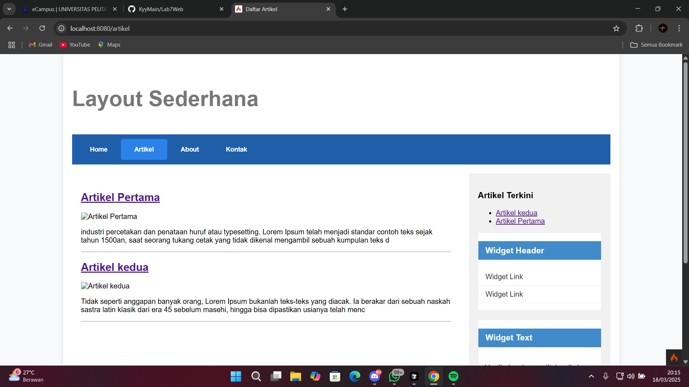
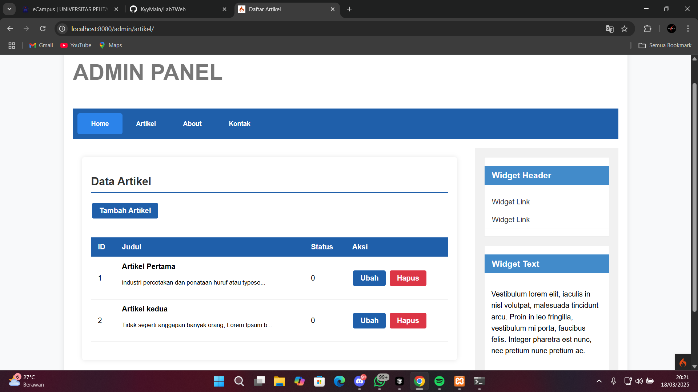
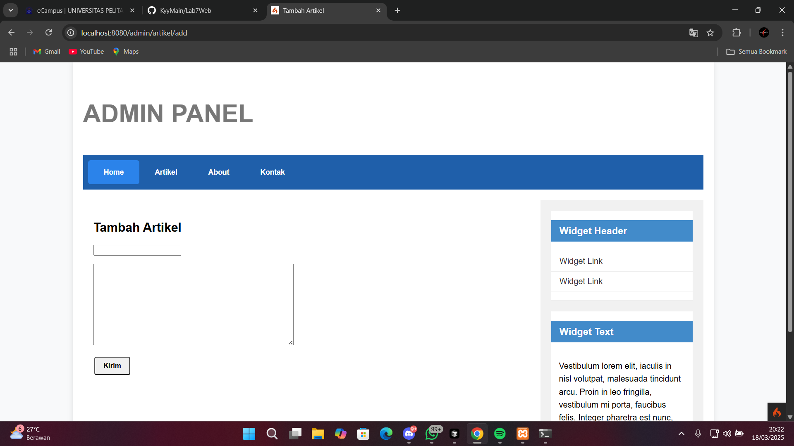

# Lab7Web
| Keterangan | Data Diri                |
| ---------- | ------------------- |
| **Nama**   | Eky Fikri Yamansyah |
| **NIM**    | 312310572           |
| **Kelas**  | TI.23.A6            |

## License
This project is licensed under the MIT License - see the [LICENSE](LICENSE) file for details.

## Laporan Project Lab 7 - CodeIgniter 4

### 1. Pendahuluan
Project ini merupakan implementasi web menggunakan framework CodeIgniter 4. CodeIgniter 4 adalah framework PHP modern yang mengikuti pola MVC (Model-View-Controller) dan menyediakan berbagai fitur untuk pengembangan web yang cepat dan efisien.

### 2. Struktur Project
Project ini terdiri dari beberapa komponen utama:
- **Controllers**: Menangani logika aplikasi
  - `Home.php`: Controller untuk halaman utama
  - `Artikel.php`: Controller untuk manajemen artikel
  - `page.php`: Controller untuk halaman statis
- **Views**: Menangani tampilan
  - Halaman utama (`home.php`)
  - Halaman artikel (`artikel/`)
  - Halaman statis (`about.php`, `contact.php`)
  - Komponen template (`components/`, `layout/`, `template/`)
- **Models**: Menangani interaksi dengan database
- **Config**: Konfigurasi aplikasi
- **Database**: Migrasi dan seeder database

### 3. Fitur Aplikasi
1. **Halaman Utama**
   - Tampilan welcome message
   - Navigasi ke berbagai halaman

2. **Manajemen Artikel**
   - Tampilan daftar artikel
   - Detail artikel
   - Fungsi CRUD artikel

3. **Halaman Statis**
   - Halaman About
   - Halaman Contact

4. **Template System**
   - Layout yang konsisten
   - Komponen yang dapat digunakan kembali
   - Sistem navigasi

### 4. Teknologi yang Digunakan
- PHP 7.4 atau lebih tinggi
- CodeIgniter 4 Framework
- MySQL Database
- HTML, CSS, JavaScript
- Bootstrap (untuk tampilan)

### 5. Instalasi dan Penggunaan
1. Clone repository
2. Konfigurasi database di file `.env`
3. Jalankan migrasi database
4. Akses melalui web server (Apache/XAMPP)

### 6. Langkah-langkah Implementasi

#### 6.1 Persiapan Awal
1. Install XAMPP (Apache, MySQL, PHP)
2. Download CodeIgniter 4 dari website resmi
3. Ekstrak file CodeIgniter ke direktori htdocs
4. Rename folder project sesuai kebutuhan

#### 6.2 Konfigurasi Database
1. Buat database baru di phpMyAdmin
2. Konfigurasi koneksi database di file `.env`:
   ```
   database.default.hostname = localhost
   database.default.database = nama_database
   database.default.username = root
   database.default.password = 
   database.default.DBDriver = MySQLi
   ```

#### 6.3 Pembuatan Controller
1. Buat controller baru menggunakan perintah:
   ```
   php spark make:controller Artikel
   ```
2. Implementasi method CRUD di controller:
   - index() - menampilkan daftar artikel
   - create() - form tambah artikel
   - store() - menyimpan artikel baru
   - edit() - form edit artikel
   - update() - update artikel
   - delete() - hapus artikel

#### 6.4 Pembuatan Model
1. Buat model baru menggunakan perintah:
   ```
   php spark make:model ArtikelModel
   ```
2. Definisikan properti dan method yang diperlukan
3. Implementasi relasi dengan tabel lain jika diperlukan

#### 6.5 Pembuatan View
1. Buat struktur folder views:
   - `views/artikel/` - untuk view artikel
   - `views/layout/` - untuk template
   - `views/components/` - untuk komponen yang dapat digunakan kembali

2. Buat file view untuk setiap halaman:
   - `index.php` - daftar artikel
   - `create.php` - form tambah
   - `edit.php` - form edit
   - `show.php` - detail artikel

#### 6.6 Implementasi Template
1. Buat layout utama di `views/layout/main.php`
2. Implementasi header dan footer
3. Buat komponen navigasi
4. Terapkan template ke semua halaman

#### 6.7 Routing
1. Konfigurasi route di `app/Config/Routes.php`
2. Definisikan route untuk setiap endpoint
3. Implementasi middleware jika diperlukan

#### 6.8 Validasi dan Keamanan
1. Implementasi validasi form
2. Tambahkan CSRF protection
3. Implementasi sanitasi input
4. Tambahkan autentikasi jika diperlukan

#### 6.9 Testing
1. Test semua fitur CRUD
2. Validasi tampilan di berbagai browser
3. Test responsivitas
4. Perbaiki bug yang ditemukan

### 7. Kode Program

#### 7.1 Controller (Artikel.php)
```php
<?php

namespace App\Controllers;

use App\Controllers\BaseController;
use App\Models\ArtikelModel;

class Artikel extends BaseController
{
    protected $artikelModel;

    public function __construct()
    {
        $this->artikelModel = new ArtikelModel();
    }

    public function index()
    {
        $data = [
            'title' => 'Daftar Artikel',
            'artikel' => $this->artikelModel->findAll()
        ];
        return view('artikel/index', $data);
    }

    public function create()
    {
        $data = [
            'title' => 'Tambah Artikel',
            'validation' => \Config\Services::validation()
        ];
        return view('artikel/create', $data);
    }

    public function store()
    {
        // Validasi input
        $rules = [
            'judul' => 'required|min_length[3]',
            'isi' => 'required'
        ];

        if (!$this->validate($rules)) {
            return redirect()->to('/artikel/create')->withInput();
        }

        $this->artikelModel->save([
            'judul' => $this->request->getPost('judul'),
            'isi' => $this->request->getPost('isi')
        ]);

        return redirect()->to('/artikel')->with('message', 'Artikel berhasil ditambahkan');
    }

    public function edit($id)
    {
        $data = [
            'title' => 'Edit Artikel',
            'artikel' => $this->artikelModel->find($id),
            'validation' => \Config\Services::validation()
        ];
        return view('artikel/edit', $data);
    }

    public function update($id)
    {
        $rules = [
            'judul' => 'required|min_length[3]',
            'isi' => 'required'
        ];

        if (!$this->validate($rules)) {
            return redirect()->to('/artikel/edit/' . $id)->withInput();
        }

        $this->artikelModel->update($id, [
            'judul' => $this->request->getPost('judul'),
            'isi' => $this->request->getPost('isi')
        ]);

        return redirect()->to('/artikel')->with('message', 'Artikel berhasil diupdate');
    }

    public function delete($id)
    {
        $this->artikelModel->delete($id);
        return redirect()->to('/artikel')->with('message', 'Artikel berhasil dihapus');
    }
}
```

#### 7.2 Model (ArtikelModel.php)
```php
<?php

namespace App\Models;

use CodeIgniter\Model;

class ArtikelModel extends Model
{
    protected $table = 'artikel';
    protected $primaryKey = 'id';
    protected $useAutoIncrement = true;
    protected $returnType = 'array';
    protected $allowedFields = ['judul', 'isi'];
    protected $useTimestamps = true;
    protected $createdField = 'created_at';
    protected $updatedField = 'updated_at';
}
```

#### 7.3 View (artikel/index.php)
```php
<?= $this->extend('layout/main') ?>

<?= $this->section('content') ?>
<div class="container mt-4">
    <h1><?= $title ?></h1>
    
    <?php if (session()->getFlashdata('message')) : ?>
        <div class="alert alert-success">
            <?= session()->getFlashdata('message') ?>
        </div>
    <?php endif; ?>

    <a href="/artikel/create" class="btn btn-primary mb-3">Tambah Artikel</a>

    <div class="table-responsive">
        <table class="table table-bordered">
            <thead>
                <tr>
                    <th>No</th>
                    <th>Judul</th>
                    <th>Aksi</th>
                </tr>
            </thead>
            <tbody>
                <?php foreach ($artikel as $row) : ?>
                    <tr>
                        <td><?= $row['id'] ?></td>
                        <td><?= $row['judul'] ?></td>
                        <td>
                            <a href="/artikel/edit/<?= $row['id'] ?>" class="btn btn-warning btn-sm">Edit</a>
                            <form action="/artikel/delete/<?= $row['id'] ?>" method="post" class="d-inline">
                                <button type="submit" class="btn btn-danger btn-sm" onclick="return confirm('Yakin ingin menghapus?')">Hapus</button>
                            </form>
                        </td>
                    </tr>
                <?php endforeach; ?>
            </tbody>
        </table>
    </div>
</div>
<?= $this->endSection() ?>
```

#### 7.4 View (artikel/create.php)
```php
<?= $this->extend('layout/main') ?>

<?= $this->section('content') ?>
<div class="container mt-4">
    <h1><?= $title ?></h1>

    <form action="/artikel/store" method="post">
        <?= csrf_field() ?>
        
        <div class="mb-3">
            <label for="judul" class="form-label">Judul</label>
            <input type="text" class="form-control <?= validation_show_error('judul') ? 'is-invalid' : '' ?>" 
                   id="judul" name="judul" value="<?= old('judul') ?>">
            <div class="invalid-feedback">
                <?= validation_show_error('judul') ?>
            </div>
        </div>

        <div class="mb-3">
            <label for="isi" class="form-label">Isi Artikel</label>
            <textarea class="form-control <?= validation_show_error('isi') ? 'is-invalid' : '' ?>" 
                      id="isi" name="isi" rows="5"><?= old('isi') ?></textarea>
            <div class="invalid-feedback">
                <?= validation_show_error('isi') ?>
            </div>
        </div>

        <button type="submit" class="btn btn-primary">Simpan</button>
        <a href="/artikel" class="btn btn-secondary">Kembali</a>
    </form>
</div>
<?= $this->endSection() ?>
```

#### 7.5 Layout (layout/main.php)
```php
<!DOCTYPE html>
<html lang="en">
<head>
    <meta charset="UTF-8">
    <meta name="viewport" content="width=device-width, initial-scale=1.0">
    <title><?= $title ?? 'CodeIgniter 4' ?></title>
    <link href="https://cdn.jsdelivr.net/npm/bootstrap@5.3.0/dist/css/bootstrap.min.css" rel="stylesheet">
</head>
<body>
    <nav class="navbar navbar-expand-lg navbar-dark bg-dark">
        <div class="container">
            <a class="navbar-brand" href="/">Lab7Web</a>
            <button class="navbar-toggler" type="button" data-bs-toggle="collapse" data-bs-target="#navbarNav">
                <span class="navbar-toggler-icon"></span>
            </button>
            <div class="collapse navbar-collapse" id="navbarNav">
                <ul class="navbar-nav">
                    <li class="nav-item">
                        <a class="nav-link" href="/">Home</a>
                    </li>
                    <li class="nav-item">
                        <a class="nav-link" href="/artikel">Artikel</a>
                    </li>
                    <li class="nav-item">
                        <a class="nav-link" href="/about">About</a>
                    </li>
                    <li class="nav-item">
                        <a class="nav-link" href="/contact">Contact</a>
                    </li>
                </ul>
            </div>
        </div>
    </nav>

    <?= $this->renderSection('content') ?>

    <footer class="bg-dark text-white text-center py-3 mt-5">
        <p class="mb-0">&copy; <?= date('Y') ?> Lab7Web. All rights reserved.</p>
    </footer>

    <script src="https://cdn.jsdelivr.net/npm/bootstrap@5.3.0/dist/js/bootstrap.bundle.min.js"></script>
</body>
</html>
```

#### 7.6 Routes (Routes.php)
```php
<?php

$routes->get('/', 'Home::index');
$routes->get('/about', 'Page::about');
$routes->get('/contact', 'Page::contact');

// Artikel Routes
$routes->get('/artikel', 'Artikel::index');
$routes->get('/artikel/create', 'Artikel::create');
$routes->post('/artikel/store', 'Artikel::store');
$routes->get('/artikel/edit/(:num)', 'Artikel::edit/$1');
$routes->post('/artikel/update/(:num)', 'Artikel::update/$1');
$routes->post('/artikel/delete/(:num)', 'Artikel::delete/$1');
```
### 8. Tampilan
#### Home Page

#### Artikel Page

#### About Page

#### Kontak Page

#### Isi Artikel

#### Admin Panel

#### Edit Artikel

#### Tambah Artikel



### 9. Kesimpulan
Project ini berhasil mengimplementasikan framework CodeIgniter 4 dengan fitur-fitur dasar seperti manajemen artikel dan halaman statis. Penggunaan pola MVC membuat kode lebih terstruktur dan mudah dimaintain. Framework ini sangat cocok untuk pengembangan web yang cepat dan efisien.

### 10. Referensi
- [CodeIgniter 4 Documentation](https://codeigniter.com/user_guide/index.html)
- [PHP Documentation](https://www.php.net/docs.php)
- [Bootstrap Documentation](https://getbootstrap.com/docs/)

